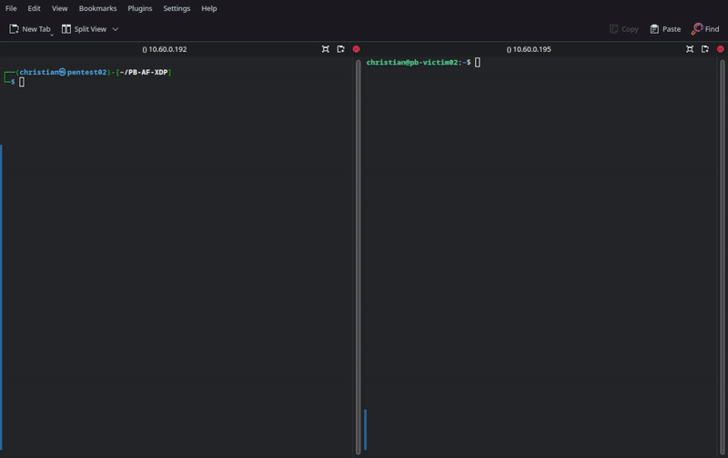
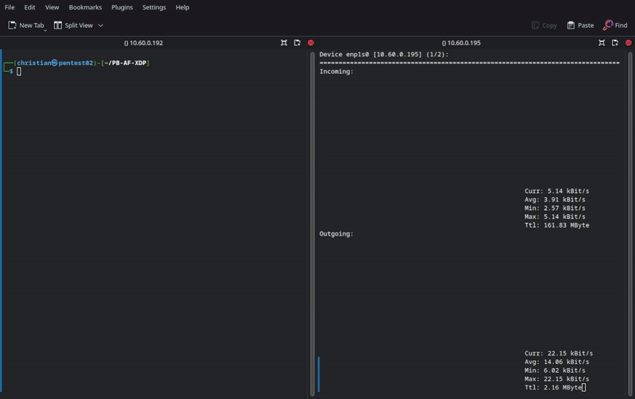

# Packet Batch (AF_XDP)
[](https://github.com/Packet-Batch/PB-AF-XDP/actions/workflows/build.yml) [](https://github.com/Packet-Batch/PB-AF-XDP/actions/workflows/run.yml)

## Description
[Packet Batch](https://github.com/Packet-Batch) is a collection of high-performance applications and tools designed for generating and sending network packets. It serves two main purposes: penetration testing, which involves assessing network security by simulating various attacks like [Denial of Service](https://www.cloudflare.com/learning/ddos/glossary/denial-of-service/) (DoS); and network monitoring, which involves analyzing and inspecting network traffic.

### Features
* The ability to send multiple network packets in a chain via sequences and multiple payloads inside of a single sequence coming from the same source.
* Support for sending from randomized source IPs within range(s) indicated by CIDR.
* Support for randomized payload data within a specific range in length.
* UDP, TCP, and ICMP layer 4 protocols supported.
* Optional layer 3 and 4 checksum calculation in the event you want the NIC's hardware to calculate checksums for generated outgoing packets.

#### Note Regarding Seeding/Randomness
When generating randomness in a packet (e.g. random source IPs, ports, payload(s), etc.), by default, we try to use nanoseconds since boot using `timespec` as the seed when passing to `[rand_r()]`(https://linux.die.net/man/3/rand_r) for example. However, I've found this isn't completely random, especially since the seed variable (`unsigned int`) and `timespec` nanoseconds variable (`long`) do not match in size.

Therefore, I added the constant [`VERY_RANDOM`](https://github.com/Packet-Batch/PB-AF-XDP/blob/master/src/sequence.h#L36) that can be uncommented. When this constant is defined, the [`getrandom()`](https://man7.org/linux/man-pages/man2/getrandom.2.html) function is used to fill the seed with random bytes. This results in more randomness, but the `getrandom()` function adds a bit more overhead than retrieving the nanoseconds since system boot from my testing.

### Disclaimer
I do **NOT** support using these tools maliciously or as a part of a targeted attack. I've made these tools to perform penetration tests against my own firewalls along with occasionally debugging network issues such as packets not arriving to their destination correctly.

### Showcase
These are just a couple of basic tests I performed between two virtual machines on my home server.





**NOTE** - Since the above demos, there was a change in Packet Batch that allows for more precise/randomized IPs/ports via seeding [here](https://github.com/Packet-Batch/PB-AF-XDP/commit/e1c872ccd10aa94120d10d120259706f31518678) (using the seed, nanoseconds since boot, instead of the UNIX timestamp which is shown above). Therefore, Packet Batch will now send from a more randomized IP/port than what is shown above!

## AF_XDP
This is a special version of Packet Batch that utilizes `AF_XDP` [sockets](https://docs.kernel.org/networking/af_xdp.html) instead of `AF_PACKETv3` (which is what the standard version uses). I recommend using this version over the standard version due to performance improvements, but you must keep in mind the following.

1. AF_XDP sockets require a **more recent** Linux kernel.
1. The TCP `cooked` and `oneconnection` settings are **NOT** available in this version due to no cooked sockets support in AF_XDP.

The above is why we aren't utilizing AF_XDP sockets in the standard version.

From the benchmarks I've concluded on my home server running Proxmox VMs, AF_XDP sockets send around 5 - 10% more packets per second than the standard version and the amount of packets per second it is sending is a lot more consistent (regardless of the batch size option explained below). I won't have solid benchmarks until I perform these tests on full dedicated hardware which should happen in early 2022.

## Building And Installing
Building and installing this project is fairly easy and just like the standard version. It includes building the Packet Batch Common repository which requires [JSON-C](https://github.com/json-c/json-c). As long as you use the `--recursive` flag with `git`, it should retrieve all of the required submodules automatically located in the `modules/` directory. Otherwise, you will need to go into the Common repository and execute the `git submodule update --init` command. We use `make` to build and install the application.

The following commands should work for Ubuntu/Debian-based systems. However, you should be able to install this on other Linux distros with a few adjustments as well.

```bash
# Update apt.
sudo apt update

# Install Git if it isn't already installed.
sudo apt install -y git

# Clone this repository along with its submodules.
git clone --recursive https://github.com/Packet-Batch/PB-AF-XDP.git

# Install build essentials/tools and needed libaries for JSON-C.
sudo apt install -y build-essential clang cmake pkgconf

# Install LibELF for BPF.
sudo apt install -y libelf-dev

# Change the current working directory to PB-AF-XDP/.
cd PB-AF-XDP/

# Execute ./build.sh file to build and install dependencies and main project which requires sudo privileges.
# WARNING - If you don't have sudo available on your system, please look at the ./build.sh file and execute make commands as root in order.
# NOTE - You may also look at the .github/workflows/build.yml.
# NOTE - The first argument represents the amount of threads to use with make. 0 uses the amount of available threads on the system and supplying no argument uses 1 thread.
./build.sh 0

# You may use the following to clean the build. You must run this as root or sudo because of the Common's cleanup.
sudo make clean
```


### Installation Video!
[](https://www.youtube.com/watch?v=2vWJUgsbbIM)

**Warning!** - The installation video is a bit outdated, but should show most of the installation process. Since the video was made, we've switched to `json-c` from `libyaml` and use a build script to build the project and its dependencies ([`./build.sh`](./build.sh)).

After installing, the executable is copied to the `/usr/bin/` directory which should be included in your `$PATH`. Therefore, you may use the application globally (in any directory).

For example.

```bash
pcktbatch -c /path/to/conf.json
```

## Command Line Usage
### Basic
Basic command line usage may be found below.

```bash
Usage: pcktbatch -c <configfile> [-v -h]

-c --cfg => Path to the config file.
-l --list => Print basic information about sequences.
-v --verbose => Provide verbose output.
-h --help => Print out help menu and exit program.
```

### First Sequence Override
If you wanted to quickly send packets and don't want to create a config file, you may specify command line options to override the first sequence. You must also specify the `-z` or `--cli` flag in order to do this.

The following command line options are available to override the first sequence.

```bash
-z --cli => Enables the first sequence/packet override.

--interface => The interface to send out of.    --block => Whether to enable blocking mode (0/1).       --track => Track packet and byte statistics and print at the end (0/1). Will impact performance!
--maxpckts => The maximum amount of packets to send during this sequence before exiting.
--maxbytes => The maximum amount of bytes to send during this sequence before exiting.
--pps => The amount of packets per second to limit this sequence to (0 = disabled).
--bps => The amount of bytes per second to limit this sequence to (0 = disabled)
--delay => The delay in-between sending packets on each thread.
--threads => The amount of threads and sockets to spawn (0 = CPU count).
--l4csum => Whether to calculate the layer-4 checksum (TCP, UDP, and ICMP) (0/1).

--smac => The ethernet source MAC address to use.
--dmac => The ethernet destination MAC address to use.

--minttl => The minimum IP TTL to use.
--maxttl => The maximum IP TTL to use.
--minid => The minimum IP ID to use.
--maxid => The maximum IP ID to use.
--sip => The source IP (one range is supported in CIDR format).
--dip => The destination IP.
--protocol => The protocol to use (TCP, UDP, or ICMP).
--tos => The IP TOS to use.
--l3csum => Whether to calculate the IP header checksum or not (0/1).

--usport => The UDP source port.
--udport => The UDP destination port.

--tsport => The TCP source port.
--tdport => The TCP source port.
--syn => Set the TCP SYN flag (0/1).
--ack => Set the TCP ACK flag (0/1).
--psh => Set the TCP PSH flag (0/1).
--rst => Set the TCP RST flag (0/1).
--fin => Set the TCP FIN flag (0/1).
--urg => Set the TCP URG flag (0/1).
--ece => Set the TCP ECE flag (0/1).
--cwr => Set the TCP CWR flag (0/1).

--pmin => The minimum payload data.
--pmax => The maximum payload data.
--pstatic => Use static payload (0/1).
--pexact => The exact payload string.
--pfile => Whether to parse a file as the 'pexact' string instead.
--pstring => Parse the 'pexact' string or file as a string instead of hexadecimal.
```

### AF_XDP
There is additional command line usage with the AF_XDP version which may be found below.

```
--queue => If set, all AF_XDP/XSK sockets are bound to this specific queue ID.
--nowakeup => If set, all AF_XDP/XSK sockets are bound without the wakeup flag.
--sharedumem => If set, all AF_XDP/XSK sockets use the same UMEM area.
--batchsize => How many packets to send at once (default 1).
--forceskb => If set, all AF_XDP/XSK sockets are bound using the SKB flag instead of DRV mode.
--zerocopy => If set, all AF_XDP/XSK sockets are attempted to be bound with zero copy mode.
--copy => If set, all AF_XDP/XSK sockets are bound with copy mode.
```

**NOTE** - The **batch size** indicates how many packets to send at the same time, but this is the **same** packet data. This may or may not speed up performance, but personally I didn't see much of an impact.

**NOTE** - By default, each socket is created in a separate thread specified in the config and is bound to a separate queue ID (incremented by 1). With that said, shared UMEM is not supported by default and each socket has its own UMEM area. The XDP wakeup flag is also specified by default which should improve performance.

## Configuration File
If you want to use more than one sequence or more control, you will need to specify sequences inside of a config file using the [JSON syntax](https://www.w3schools.com/js/js_json_syntax.asp).

Before continuing, here is information on the types used below with the config.

| Name | Length (Bytes) | Unsigned | Description |
| ---- | ------ | -------- | ----------- |
| string | N/A | N/A | A string terminated by `\0`. |
| byte | 1 | yes | A single byte integer. |
| boolean | 1 | yes | A single `true` (1) or `false` (0) value. |
| ushort | 2 | yes | An unsigned short. |
| short | 2 | no | A short. |
| uint | 4 | yes | An unsigned integer. |
| int | 4 | no | An integer. |
| ulong | 8 | yes | An unsigned long. |
| long | 8 | no | A long. |

Here is the full config file format.

| Key | Type | Default | Description |
| --- | ---- | ------- | ----------- |
| `interface` | string | `null` | The default interface to send packets out of. |
| `sequences` | Array `Sequence` Object | `[]` | An array of sequences to use (see below). |

<details>
    <summary>Examples</summary>
Basic config.

```json
{
    "interface": "devint",
    "sequences": [
        {
            ...
        },
        {
            ...
        }
    ]
}
```
</details>

### Sequence Object
The sequence object has the following fields.

| Key | Type | Default | Description |
| --- | ---- | ------- | ----------- |
| `interface` | string | `null` | The interface to use when sending out of this sequence. |
| `block` | boolean | `true` | Whether to block the main thread/other sequences until this sequence is completed. |
| `track` | boolean | `false` | Tracks total packets/bytes including average per second for the sequence and prints before the program exits. This will impact performance! |
| `maxpckts` | ulong | `0` | If above 0, the sequence will exit after hitting this amount of total packets sent. |
| `maxbytes` | ulong | `0` | If above 0, the sequence will exit after hitting this amount of total bytes sent. |
| `pps` | ulong | `0` | If above 0, will limit the sequence to this amount of packets per second. |
| `bps` | ulong | `0` | If above 0, will limit the sequence to this amount of bytes per second. |
| `time` | ulong | `0` | If above 0, will limit the sequence to this amount of time in seconds before exiting. |
| `threads` | ushort | `0` | If 0, will spawn *x* amount of threads for this sequence. Otherwise, uses CPU count. |
| `delay` | ulong | `1000000` | The delay between each iteration (sent packet) in the sequence in microseconds. |
| `l4csum` | boolean | `true` | Whether to calculate the layer-4 checksum in the program. |
| `eth` | Ethernet Object | `{}` | The ethernet header object (see below). |
| `ip` | IP Object | `{}` | The IP header object (see below). |
| `udp` | UDP Object | `{}` | The UDP header object (see below). |
| `tcp` | TCP Object | `{}` | The TCP header object (see below). |
| `icmp` | ICMP Object | `{}` | The ICMP header object (see below). |
| `payloads` | Array `Payload` Object | `[]` | The payloads array (see below). |

<details>
    <summary>Examples</summary>

The following sends packets out of the `dev` interface. It blocks the thread and only runs for 20 seconds. There is a 100000 microsecond delay in-between sending packets on the main sequence.

```json
{
    "interface": "dev",
    "block": true,
    "time": 20,
    "delay": 100000,
    "eth": {
        ...
    },
    "ip": {
        ...
    },
    "tcp": {
        ...
    },
    "udp": {
        ...
    },
    "icmp": {
        ...
    },
    "payloads": [
        ...
    ]
}
```

The following sends packets out of the `dev` interface. It blocks the thread and only runs until 3000 packets sent. there is no delay between sending packets, so it will send packets as fast as it can.

```json
{
    "interface": "dev",
    "block": true,
    "maxpckts": 3000,
    "time": 0,
    "delay": 0,
    "eth": {
        ...
    },
    "ip": {
        ...
    },
    "tcp": {
        ...
    },
    "udp": {
        ...
    },
    "icmp": {
        ...
    },
    "payloads": [
        ...
    ]
}
```

The following sends packets out of the `dev` interface. It blocks the thread and runs until you hit CTRL + C or use another method to kill the process. The sequence is limited to sending 300 packets per second.

```json
{
    "interface": "dev",
    "block": true,
    "pps": 300,
    "time": 0,
    "delay": 0,
    "eth": {
        ...
    },
    "ip": {
        ...
    },
    "tcp": {
        ...
    },
    "udp": {
        ...
    },
    "icmp": {
        ...
    },
    "payloads": [
        ...
    ]
}
```
</details>

#### Ethernet Object
The ethernet object contains the following fields.

| Key | Type | Default | Description |
| --- | ---- | ------- | ----------- |
| `smac` | string | `null` | The source MAC address to use. If not set, will attempt to retrieve the source MAC address automatically. |
| `dmac` | string | `null` | The destination MAC address to use. If not set, will attempt to retrieve the destination MAC address automatically via gateway. |

<details>
    <summary>Examples</summary>

The following sends packets from `09:EB:23:AB:2D:B1` to `08:EC:4B:23:F2:E3`.

```json
{
    "smac": "09:EB:23:AB:2D:B1",
    "dmac": "08:EC:4B:23:F2:E3"
}
```
</details>

#### IP Object
The IP object contains the following fields.

| Key | Type | Default | Description |
| --- | ---- | ------- | ----------- |
| `sip` | string | `null` | The source IP to send from. |
| `dip` | string | `null` | The destination IP to send to. |
| `protocol` | string | `null` | The layer-4 protocol. Available options include `tcp`, `udp`, and `icmp`. |
| `tos` | byte | `0` | The Type of Server (ToS) to use. |
| `csum` | boolean | `true` | Whether to calculate the IP header checksum. |
| `ttl` | TTL Object | `{}` | The TTL object (see below). |
| `id` | ID Object | `{}` | The ID object (see below). |
| `ranges` | Array `String` | `{}` | An array of IP ranges that should be in the `<ip>/<cidr>` format. |

<details>
    <summary>Examples</summary>

Here's an example that sends packets from `192.168.2.2` to `192.168.2.3`. The protocol is TCP.

```json
{
    "sip": "192.168.2.2",
    "dip": "192.168.2.3",
    "protocol": "tcp",
    "csum": true,
    "ttl": {
        ...
    },
    "id": {
        ...
    },
    "ranges": [
        ...
    ]
}
```

Here's another example that sends packets from random IPs within the `10.4.0.0/24` and `10.5.0.0/24` ranges to `10.3.0.2`. The protocol used is UDP.

```json
{
    "sip": null,
    "dip": "10.3.0.2",
    "protocol": "udp",
    "csum": true,
    "ranges": [
        "10.4.0.0/24",
        "10.5.0.0/24"
    ]
}
```
</details>

##### TTL Object
The TTL object contains the following fields.

| Key | Type | Default | Description |
| --- | ---- | ------- | ----------- |
| `min` | byte | `64` | The minimum TTL to use. |
| `max` | byte | `64` | The maximum TTL to use. |

<details>
    <summary>Examples</summary>

Here's an example of generating a TTL between `64` and `128` every time we generate a packet.

```json
{
    "min": 64,
    "max": 128
}
```
</details>

##### ID Object
The ID object contains the following.

| Key | Type | Default | Description |
| --- | ---- | ------- | ----------- |
| `min` | byte | `0` | The minimum ID to use. |
| `max` | byte | `64000` | The maximum ID to use. |

<details>
    <summary>Examples</summary>

Here's an example of generating an ID between `4000` and `9000` every time we generate a packet.

```json
{
    "min": 4000,
    "max": 9000
}
```
</details>

#### TCP Object
The TCP object contains the following fields.

| Key | Type | Default | Description |
| --- | ---- | ------- | ----------- |
| `sport` | ushort | `0` | The TCP source port to use. If 0, will generate a random port. |
| `dport` | ushort | `0`| The TCP destination port to use. If 0, will generate a random port.
| `syn` | boolean | `false` | Sets the TCP SYN flag. |
| `psh` | boolean | `false` | Sets the TCP PSH flag. |
| `fin` | boolean | `false` | Sets the TCP FIN flag. |
| `ack` | boolean | `false` | Sets the TCP ACK flag. |
| `rst` | boolean | `false` | Sets the TCP RST flag. |
| `urg` | boolean | `false` | Sets the TCP URG flag. |
| `ece` | boolean | `false` | Sets the TCP ECE flag. |
| `cwr` | boolean | `false` | Sets the TCP CWR flag. |

<details>
    <summary>Examples</summary>

Here's an example of sending packets with the SYN flag set to port `80`.

```json
{
    "dport": 80,
    "syn": true
}
```
</details>

#### UDP Object
The UDP object contains the following.

| Key | Type | Default | Description |
| --- | ---- | ------- | ----------- |
| `sport` | ushort | `0` | The UDP source port to use. If 0, will generate a random port. |
| `dport` | ushort | `0` | The UDP destination port to use. If 0, will generate a random port. |

<details>
    <summary>Examples</summary>

Here's an example of sending packets from UDP source port `27005` to destination port `27015`.

```json
{
    "sport": 27005,
    "dport": 27015
}
```
</details>

#### ICMP Object
The ICMP object contains the following fields.

| Key | Type | Default | Description |
| --- | ---- | ------- | ----------- |
| `code` | byte | `0` | The ICMP code to set. |
| `type` | byte | `0` | The ICMP type to set. |

<details>
    <summary>Examples</summary>

Here's an example of sending an ICMP echo request (type 8 and code 0).

```json
{
    "code": 0,
    "type": 8
}
```
</details>

#### Payload Object
The payload object contains the following fields.

| Key | Type | Default | Description |
| --- | ---- | ------- | ----------- |
| `exact` | string | `null` | The exact payload in hexadecimal. |
| `isstatic` | boolean | `false` | Whether the payload is static (shouldn't change). If `exact` isn't set, it will generate payload once and reuse that payload each time. |
| `isfile` | boolean | `false` | Whether `exact` should act as the path to the file and read as is. |
| `isstring` | boolean | `false` | Whether to parse `exact` as a string instead of hexadecimal. |
| `length` | Length Object | `{}` | The length object (see below). |

<details>
    <summary>Examples</summary>

This example sends packets with the payload `0x01 0xFB 0x02 0xFC` (4 bytes in payload size).

```json
{
    "exact": "01 FB 02 FC"
}
```

This example sends packets with a random payload between 0 and 5 bytes.

```json
{
    "length": {
        "min": 0,
        "max": 5
    }
}
```

This example parses `./mypayload.txt` as hexadecimal and uses that as the payload.

```json
{
    "exact": "./mypayload.txt",
    "isfile": true
}
```

This example parses `GET / HTTP/1.0\r\nHost: 1.2.3.4\r\n\r\n` as a string and uses that as the payload.

```json
{
    "exact": "GET / HTTP/1.0\r\nHost: 1.2.3.4\r\n\r\n",
    "isstring": true
}
```
</details>

##### Length Object
The length object contains the following fields.

| Key | Type | Default | Description |
| --- | ---- | ------- | ----------- |
| `min` | ushort | `0` | The minimum length. |
| `max` | ushort | `0` | The maximum length. |

If you are looking for full examples, please check out [this repository](https://github.com/Packet-Batch/PB-Tests).

**NOTE** - The default config path is `/etc/pcktbatch/conf.json`. This may be changed via the `-c` and `--cfg` flags as explained under the Command Line Usage section below.

## Credits
* [Christian Deacon](https://github.com/gamemann)
